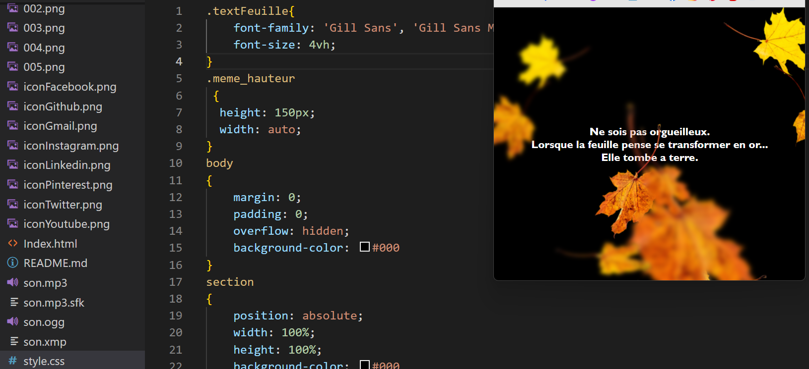

### Premier projet HTML / CSS 

  

 

### Début de formation
Petit projet après une formation HTML - CSS

Les feuilles tombent et laissent apparaitre un message 

### Voir le résultat sur le lien indiqué : 

 <a href="https://kevinozkaraca.github.io/Feuille_morte_CSS/" target="_blank">Cliquer ICI !</a>

### Mes reseaux sociaux : 

    

            
            
             
            
            
            
            
            
    
  

